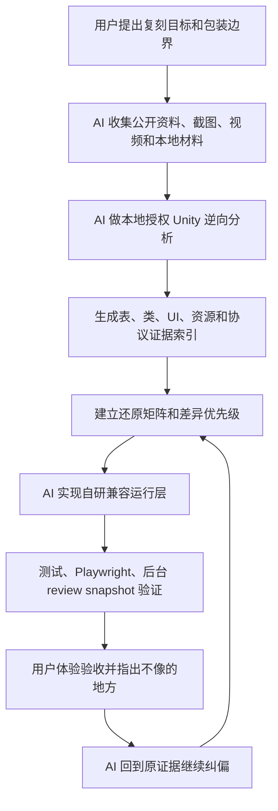

# AI 驱动 BidKing 复刻开发心路与操作层技术方案归档

> 初版归档：2026-05-25  
> 最近维护：2026-05-28  
> 维护状态：长期维护。本文不是过时过程记录，而是项目更深层目标和 AI 驱动生产方法的持续归档。  
> 面向读者：制作人、项目负责人、老板、需要评估 AI 驱动研发方式的人  
> 归档口径：本文总结的是“怎么组织一次 AI 驱动的玩法复刻生产”，不是介绍项目用了什么技术栈。  
> 边界说明：本项目基于本地授权材料做机制分析，只复刻玩法规则和流程；源码、美术、音频、文案、模型和线上服务能力不直接使用、不提交、不分发。

## 维护口径

本文从历史过程记录中移回 `doc/` 根目录，作为 BidKingdom 的第三条长期归档线维护：

- 原版事实账本：`doc/竞拍之王源码策划归档/`，只记录原版源码、源表、协议和可验证表现事实。
- 当前实现账本：`doc/BidKingdom当前实现策划归档/`，记录 BidKingdom 如何复刻、包装和落到工程文件。
- AI 驱动生产账本：本文，记录“AI 如何发现事实、拆解差异、实现、验证、归档和约束自己继续工作”。
- AI 协作耗时账本：`doc/AI驱动BidKing复刻开发耗时统计归档.md`，记录会话耗时、并行墙上时间和工作类型分类。

凡是项目的 AI 协作方式、证据链、不直接使用原商业源码和素材的边界、文档同步机制、验收方法或复刻生产流程发生实质变化，都应补到本文。它不替代两套策划归档，也不承载原版规则口径；它维护的是这套研发方式本身。

## 一句话版本

这个项目不是传统意义上“人先完整设计游戏，AI 帮忙写代码”的项目，而是一次 **AI 主导发现、拆解、验证和落地的玩法复刻**：玩法规则和流程按原版还原，素材和包装全部自制替换；人主要提出复刻目标、包装边界和验收反馈，AI 负责从资料调研、逆向工程、规则提炼、工程实现、测试证据到文档归档的全链路生产。

## 核心结论

本项目的真实开发路径可以概括为：

```text
人给目标：复刻 BidKing 核心玩法，包装可以换，逻辑不能乱改
AI 找答案：原游戏到底怎么跑、哪些规则是核心、哪些只是包装
AI 拆系统：截图、视频、配置表、反编译代码、资源索引全部转成可执行任务
AI 做实现：按表、类、窗口、协议、状态机逐步建立 Web 复刻
AI 做验证：测试、Playwright、后台审计、矩阵文档共同证明“还原到哪里”
人做验收：指出不像、信息太多、包装不对应、结算不对等关键偏差
AI 再闭环：继续查原游戏证据，修实现，补文档，形成下一轮归档
```

这里最重要的不是“AI 提高了写代码速度”，而是 AI 把过去需要多岗位协同的流程压缩成一个连续链路：竞品研究、逆向分析、系统策划、程序实现、测试、文档、审计、素材生产计划都由同一个 AI 工作流持续推进。

## 项目定位

项目目标不是原创设计一个竞拍游戏，而是复刻《BidKing / 竞拍之王》的核心体验，并在视觉、题材、角色、文案和素材层做自制包装替换。

本项目一直遵守两条线：

- 玩法线：核心规则、出价节奏、仓库信息揭示、竞买人技能、结算流程、局外关键系统要尽量贴近原版。
- 包装线：名称、文案、视觉、角色外观、藏品图、主题表达可以换成自己的“珍宝局 / 古代珍宝”包装。

用户在开发中的主要要求不是“帮我设计一个更好玩的新游戏”，而是反复强调：

- 复刻，不要发明一套新逻辑。
- 包装可以换，但实际技能和功能不能变。
- 跟原版不一样的地方要查证，不要靠想象补。
- AI 需要自己根据截图、视频、配置和代码把事实找出来。

因此，本项目更适合被定义为：

```text
AI 驱动的竞品机制复刻与工程化验证项目。
```

## 开发心路历程

### 1. 一开始不是复刻，而是内部 Demo 方案

最早阶段位于一个本地旧仓库工作区，具体本机路径已脱敏。

2026-05-17 的早期文档还是“B/S 内部试验 Demo 需求分析与技术方案”。当时的思路是做一个多人暗拍博弈 Demo，重点是 4 人竞拍、线索、角色技能、开箱复盘、局外图鉴，并且从一开始就确定使用服务端权威、事件日志和隐藏信息边界。

这一阶段 AI 的作用是从已有设计文档、竞品页面、玩家反馈和可复用资产流程中，先搭出“能上线首版倒推”的 Demo 方案。但这还不是最终的复刻路线。

关键资料：

- `doc/过时/已执行修改计划/20260517_BS内部试验Demo需求分析与技术方案归档.md`

### 2. 第一次关键转向：AI 发现当前 Demo 与 BidKing 核心结构不一致

2026-05-17 到 2026-05-18，AI 对 BidKing 的截图、视频帧、商店页、公告和现有 Demo 进行了对照，得出第一个决定性结论：

```text
BidKing 的核心不是“5 轮 5 个货柜”，而是“同一个仓库进行 5 轮渐进揭示与出价”。
```

这个发现改变了整个项目方向。此前 Demo 更像一个原创竞拍桌游，之后项目转为围绕原版核心结构复刻：

- 同仓五轮。
- 明拍/暗拍。
- 仓库格子与 Loot 区。
- 稀有度、轮廓、品类、价值等渐进信息。
- 竞买人技能改变可见信息。
- 最终独立开箱结算。

这不是用户预先写好的设计目标，而是 AI 在资料分析中推导出来的事实。用户主要做的是确认方向，并继续要求“按原游戏复刻”。

关键资料：

- `doc/过时/旧报告与调研/20260517_竞拍之王玩法界面调研与当前实现差异.md`

### 3. 第二次关键转向：从公开资料分析进入本地授权逆向工程

2026-05-18，AI 对本地授权 Unity 副本做只读分析，完成了代码、配置和资源索引提取。

这一步是整个项目的技术分水岭。项目不再只靠截图猜玩法，而是把原版的运行依据拆成可查询证据：

- 反编译 `Scripts`，得到 1256 个 `.cs` 原类索引。
- 解码 52 张配置表，共 19687 行数据。
- 建立 `Item / BidMap / Drop / Hero / Skill / SkillEffect / RankMap / RankAi / UIWnd / Constant / Condition` 等关键表索引。
- 建立资源索引、AssetBundle 对象索引和 UI prefab 参考入口。
- 明确素材与源码使用边界：原始资源和反编译代码只用于本机分析，不进入提交和分发。

这一步基本是 AI 独立完成：找加载逻辑、还原表、生成索引、识别关键字段、写提取报告、输出后续复刻优先级。

关键资料：

- `doc/过时/旧报告与调研/20260518_BidKing_Unity逆向初步盘点.md`
- `doc/过时/旧报告与调研/20260518_BidKing代码配置资源提取报告.md`
- `doc/过时/历史证据与过程记录/20260521_BidKing逆向资料快速查询索引.md`

### 4. 从“像”到“可证明地像”：建立矩阵化还原账本

后续开发没有只靠主观体验判断“像不像”，而是把复刻拆成四类账本：

- 原类矩阵：1256 个源码类映射到当前工程模块。
- 表矩阵：52 张配置表逐表登记行数、字段、owner、运行状态。
- UIWnd 矩阵：80 个原窗口映射到当前窗口/路由/语义。
- 验收矩阵：M0-M11 阶段验收项、证据和状态。

这个方法的价值在于，它把“复刻一个复杂游戏”变成可审计的生产流程：

```text
原始证据 -> 当前实现入口 -> 测试或截图证据 -> 缺口等级 -> 下一轮修复
```

这也是制作层最值得复用的方法：不要让 AI 只写功能，而是让 AI 先建立“原版事实账本”和“当前差异账本”。

关键资料：

- `doc/过时/历史证据与过程记录/bidking_restore_class_matrix.md`
- `doc/过时/历史证据与过程记录/bidking_restore_table_matrix.md`
- `doc/过时/历史证据与过程记录/bidking_restore_uiwnd_matrix.md`
- `doc/过时/历史证据与过程记录/bidking_restore_acceptance_matrix.md`

### 5. 从旧仓库迁移到独立工程

2026-05-21，项目从本地旧仓库工作区迁移到当前独立仓库，具体本机路径已脱敏。

旧仓库最终提交中有：

```text
0c4f6c02 移除已迁移 BidKingdom 工程
```

当前仓库起点是：

```text
9ac53b0 迁移 BidKingdom 独立工程
```

也就是说，当前仓库不是项目起点，而是继承了旧仓库中已经高度成型的 `bitkingdom` 子工程。后续独立仓库阶段主要做两类事：

- 产品化：账号持久化、仓库出售、市场、邮件补偿、异常中心、后台审计。
- 深水区还原：经济常量、RankAi、BattleItem、SkillEffect、送拍、拍卖行、竞买人顺序和技能语义等。

### 6. 最近阶段：从“整体复刻”进入“逐点纠偏”

2026-05-23 到 2026-05-25，开发进入更精确的核对阶段。

典型例子是竞买人系统。用户指出“竞买人设定在文本包装上看不出和原版一一对应”，AI 随后根据截图顺序、原表配置和代码逻辑整理了原版 20 个竞买人设定，再设计一一对应的包装改版，并修正了当前实现：

- 顺序按截图固定为 `104,107,108,101,105,110,208,209,102,103,106,109,201,202,203,204,205,206,207,301`。
- 包装角色绑定固定 `sourceHeroId`。
- 文案可以换，但技能效果继续读取原 `Hero.cast_type -> Skill -> SkillEffect` 链路。
- 修复下标推断导致的角色技能错绑风险。
- 补 `skill_count_type=2` 的百分比目标数量解释。
- 修正多效果技能文案和知识输出。

这说明项目后半段的心路已经从“做一个能跑的 Demo”变成“每个看似包装的地方都要回到原表和源码证据上核对”。

关键资料：

- `doc/过时/历史证据与过程记录/20260525_BidKing竞买人原版设定与技能链归档.md`
- `doc/过时/历史证据与过程记录/20260525_BidKing竞买人改版对应与当前实现核对归档.md`

### 7. 从过程记录进入长期生产控制面

2026-05-26 到 2026-05-28，项目又发生了一次更深的转向：重点不再只是继续补功能，而是把“AI 怎样持续不跑偏”本身制度化。

这一阶段的核心动作包括：

- 文档体系从早期报告和过程记录，整理成两套当前有效分卷：`竞拍之王源码策划归档` 记录原版事实，`BidKingdom当前实现策划归档` 记录当前实现落点。历史计划、旧报告、验收矩阵和过程记录被移入 `过时/`，避免旧口径继续污染当前复刻判断。
- 原版还原口径进一步细分成 A/B/C/D 证据等级：源表、协议和 Unity 客户端为强证据；原版后端不可见的部分按协议和客户端消费方式推断实现，但必须标注为“协议推断”，不能伪装成源码事实。
- 旧 Demo 残留被清零：`warehouse_roll`、脚本货柜、旧公共/私人线索、旧手动技能、押金/保险/次高价/推荐价等早期原创逻辑从可运行链路移除，核心局只保留源表和协议能支撑的 `intel -> auction -> settlement/reveal` 复刻流程。
- 字段级源码比对补到 `GameData / RoomData / SendAuctionGameData / MailItemData / ShopStatusData`，并把场景随机、情报暗牌、技能提示串行入列、右仓同步、终局逐件 loading 揭露、局内仓库格和当前预估最低价都写成固定验收点。
- 普通匹配从前端本地倒计时改为服务端权威匹配池：玩家按拍场、明暗拍和人数分桶，人数够立即成局，等待超时后补 Bot 成局；前端只负责显示 `Match_Main` 式悬浮窗和发送取消请求，不再决定开局。
- 素材链路从早期样例资产转向 approved WebP、源表绑定资源键、懒加载和正式 UI 图素；视觉仍是自制替代，不把原商业资源带入分发工程。
- Agent 规则本身开始纳入项目资产：`bidkingdom-doc-sync.mdc` 负责文档同步约束，`bidkingdom-main-only.mdc` 负责单主干维护纪律，避免下一轮 AI 只靠聊天记忆工作。

这一步的意义是：项目开始把“复刻生产方式”也当成产品来维护。AI 不只是继续查代码、写代码、跑测试，而是把自己的工作边界、证据优先级和文档同步义务写进仓库规则里。

### 8. 新增总结：复刻生产不只有代码账

这一阶段给出的新结论是：复杂复刻项目至少需要三本账同时存在。

| 账本 | 记录对象 | 失败风险 |
| --- | --- | --- |
| 原版事实账本 | 原表、源码、协议、截图、视频和可验证行为 | 没有它，AI 会凭感觉“优化”原玩法 |
| 当前实现账本 | 当前工程文件、接口、状态机、UI 和测试落点 | 没有它，复刻会变成无法验收的口头完成 |
| 生产方法账本 | AI 怎么取证、拆解、实现、验证、归档和约束自己 | 没有它，下一轮协作会重新犯旧错 |

本文维护的正是第三本账。它解释为什么这个项目不是普通 Demo，也不是单纯的代码生成项目，而是一次把 AI 放到制作流程中枢的长期实验。

## AI 的实际作用

这个项目中 AI 不是单点工具，而是事实上的研发执行中枢。

### AI 做了什么

AI 在项目中承担了这些工作：

- 竞品研究：从 Steam、截图、视频帧、评论、公告中分析原游戏核心循环和玩家痛点。
- 逆向工程：只读分析本地 Unity 构建，解码 DLL、配置表、资源索引和 UI prefab 线索。
- 规则提炼：把 `BidMap / Drop / Item / Hero / Skill / SkillEffect / RankMap / RankAi` 等表转为当前运行规则。
- 方案拆解：把“复刻 BidKing”拆成表、类、窗口、协议、状态机、UI、测试证据。
- 程序实现：持续补 match-core、server、web、compat runtime、profile、market、admin、Playwright 等模块。
- 测试验证：编写单测、路由测试、Playwright 桌面/移动冒烟、后台 review snapshot。
- 文档归档：每轮开发后生成审查报告、验收包、实施计划、矩阵和快速查询索引。
- 素材生产管理：建立藏品图生成队列、提示词、验证脚本、联排预览和替换计划。
- 维护规则沉淀：把双轨归档、主干工作流和本文维护义务写入 `.cursor/rules`，让后续 AI 任务从入口规则开始就受约束。

### 人做了什么

人的作用更像制作人和验收方，而不是传统设计师或程序主力：

- 指定目标：复刻 BidKing，而不是自由设计一个新游戏。
- 指定边界：包装可以换，但核心玩法和技能逻辑不能变。
- 做体验纠偏：指出“不像原版”“信息太多”“结算界面不对”“竞买人不对应”等问题。
- 做质量判断：决定哪些 AI 输出可接受，哪些必须重新查证和重做。
- 做方向控制：当 AI 有发散或自创倾向时，把它拉回“复刻”目标。

这类协作的本质是：

```text
人负责目标、边界、审美和验收。
AI 负责发现、拆解、实现、验证和归档。
```

## 操作层技术方案

这里的“技术方案”不是 React、Node、Socket.IO 这类选型，而是项目实际怎么被组织、推进和验收。

### 1. 先冻结复刻口径

所有工作先分成两层：

| 层级 | 是否允许改变 | 处理口径 |
| --- | --- | --- |
| 核心玩法 | 原则上不允许 | 对局结构、出价、揭示、竞买人技能、结算、经济关键规则必须查原版依据 |
| 包装表达 | 允许改变 | 角色名、题材、美术、文案可以换，但不能改变功能含义 |

这一步解决了 AI 开发中最容易失控的问题：AI 很容易“优化”玩法或补自创逻辑。项目通过反复强调“复刻”，把 AI 的创造力限制在包装、实现路径和验证方法上。

### 2. 建立证据采集链

AI 按可靠性分层采集证据：

- 公开资料：商店页、公告、评论、截图、视频帧，用于判断大方向和玩家体验。
- 本地材料：截图、录像、安装目录、Unity 构建，用于核对真实界面和运行资源。
- 配置表：52 张表作为数值、字段、ID、概率、技能链的主要依据。
- 反编译代码：用于判断表字段如何被读取、UI 如何调用、协议如何流转。
- 当前实现：用代码搜索、测试和截图证明“现在到底做到哪”。

证据不是散落在聊天里，而是被归档成文档、索引和矩阵。

### 3. 把原游戏拆成可执行账本

AI 不直接说“做完整复刻”，而是把目标拆成可追踪账本：

| 账本 | 作用 |
| --- | --- |
| 类矩阵 | 原版源码类到当前模块的映射，避免漏系统 |
| 表矩阵 | 每张表的行数、字段、用途、运行状态 |
| UIWnd 矩阵 | 原版窗口到当前前端入口的映射 |
| 协议矩阵 | 原版 C2S/S2C 或客户端流程到当前 REST/Socket 替代入口 |
| 验收矩阵 | 每个阶段的状态、证据和硬条件 |
| Playwright 证据清单 | 桌面/移动实际页面是否可达、是否重叠、是否能操作 |

这种方式让老板和制作人可以看到：不是“AI 说完成了”，而是每个系统都有证据位置。

### 4. 用“差异优先级”驱动开发

每次用户反馈“不像”，AI 不应直接凭感觉改 UI，而是先定位差异属于哪类：

| 差异类型 | 处理方法 |
| --- | --- |
| 玩法结构差异 | 查原版核心循环和配置表，优先改状态机 |
| 信息可见性差异 | 查技能链、表字段、private/public snapshot，避免提前泄露 |
| UI 呈现差异 | 查截图、Prefab、UIWnd、Playwright 截图证据 |
| 文案包装差异 | 查原版技能含义，允许换说法但不换功能 |
| 经济/交易差异 | 查 Constant、Item、Shop、Market、Auction、Mail 等表和代码入口 |
| 外部服务差异 | 明确标记为 Service Simulated，不伪装成完全等价 |

项目中多次出现这种模式：用户发现体验不对，AI 回到原证据，重新拆差异，再补实现和文档。

### 5. 实现层采用“兼容运行层”

项目没有把 Unity 源码直接搬过来，而是建立自研兼容运行层：

```text
原配置表和源码事实
        ↓
bidking-compat 表解释与 helper
        ↓
match-core / server / web 运行逻辑
        ↓
后台审计、测试、Playwright 证据
```

这个方案的意义：

- 保留原 ID、字段、行数、概率、技能链作为事实依据。
- 当前工程用自己的状态机和 Web 实现承载玩法。
- 原始商业代码和资源不进入分发。
- 可以清楚标记哪些是 Equivalent，哪些是 Visual Substitute，哪些是 Service Simulated。

### 6. 验证不是最后一步，而是开发的一部分

项目把验证分成几类：

- 单元测试：锁定 match-core、compat runtime、技能、条件、经济公式。
- 服务端测试：锁定 profile、market、mail、auction、routes、admin snapshot。
- Web 构建和类型检查：锁定前后端契约。
- Playwright：锁定桌面/移动可达性、关键窗口、局内流程、后台页面。
- 后台 review snapshot：把 52 表、矩阵摘要、Equivalent 分类、验证命令导出成机器可读快照。
- 文档复审：每次大改后更新归档，避免只剩代码没有生产记忆。

这套方法让 AI 输出不只是“跑起来”，而是能持续回答：

```text
现在还原到哪里？
证据在哪里？
哪些地方只是替代？
下一个最重要缺口是什么？
```

### 7. 包装和素材也进入 AI 流水线

包装层没有靠临时占位图混过去，而是建立了 AI 素材生产流程：

- 根据原 `Item` 表和包装方向生成藏品命名。
- 按批次生成正式美术队列。
- 用提示词控制“古代珍宝、具体实物、无文字、无水印、透明或绿幕处理”。
- 用脚本规范化、校验和生成联排预览。
- 对重复、抽象、占位、风格不符的图片继续追踪重做。

这里同样体现 AI 驱动：AI 不只是生成图，而是管理素材生产队列、验证规则和归档。

### 8. 把维护规则写进 Agent 入口

2026-05-26 之后的一个重要补充是：项目不再只要求“本轮 AI 记住规则”，而是把规则写入仓库入口。

当前约束分三层：

| 规则 | 文件 | 作用 |
| --- | --- | --- |
| AGENTS 索引 | `AGENTS.md` | 只做入口导航，不重复维护细则 |
| 文档同步规则 | `.cursor/rules/bidkingdom-doc-sync.mdc` | 约束原版事实、当前实现和本文的同步维护 |
| Git 工作流规则 | `.cursor/rules/bidkingdom-main-only.mdc` | 约束本仓库只维护 `main` 长期主干 |

这让 AI 协作从“靠对话上下文记忆”升级为“靠仓库规则持续约束”。对长期项目来说，这和代码测试一样重要：测试约束程序行为，mdc 约束协作者行为。

## 工作流图



## 完整时间线

| 日期 | 阶段 | 关键动作 | AI 的作用 |
| --- | --- | --- | --- |
| 2026-05-17 | 内部 Demo 方案 | 从多人暗拍设计和竞品资料出发，形成 B/S Demo 方案 | 需求分析、产品结构、服务端权威和隐藏信息边界设计 |
| 2026-05-17 到 05-18 | 核心差异发现 | 发现原版是同仓 5 轮渐进揭示，不是 5 轮 5 货柜 | 从截图、视频和当前 Demo 对照中主动纠偏 |
| 2026-05-18 | 本地逆向工程 | 解码 DLL、52 表、资源索引、关键代码入口 | 纯 AI 执行分析、提取、索引和报告归档 |
| 2026-05-18 | 核心复刻起步 | 引入 BidMap、Drop、Item、Hero、Skill、RankMap 等表 | 把原表转成当前工程可运行的兼容层 |
| 2026-05-18 到 05-20 | 全表推进 | 52 表、1256 类、80 UIWnd、M0-M11 验收矩阵 | 建立审计账本，持续补运行闭环 |
| 2026-05-20 | Equivalent 收口 | 形成最终验收包、review snapshot、Playwright 证据 | 让“还原完成度”可复审、可重跑 |
| 2026-05-21 | 独立仓库迁移 | 从 `A1\a1\bitkingdom` 迁到 `bidkingdom` | 迁移工程、忽略规则、文档和运行材料 |
| 2026-05-21 到 05-23 | 产品化与深水区 | 账号、仓库、市场、邮件、异常、经济、Bot、结算仪式 | 持续实现、测试和归档 |
| 2026-05-23 | 逐模块审计 | 对源码与当前实现做百分比还原度评估 | 诚实暴露 P0/P1/P2 缺口，避免虚假完成 |
| 2026-05-25 | 竞买人精确纠偏 | 20 个竞买人按原顺序、源 Hero、技能链一一绑定 | 从截图、表、代码到实现修复全流程闭环 |
| 2026-05-26 | 文档体系重整 | 旧计划和过程记录移入 `过时/`，当前依据拆成原版事实和当前实现两套分卷 | 把复刻判断从聊天记忆迁移到长期文档规则 |
| 2026-05-26 | 旧 Demo 清零 | 清理旧阶段、旧线索、旧手动技能和旧样例资产，补源码音效与飘字反馈 | 用删除和收窄保证运行链路只剩原版证据可支撑的规则 |
| 2026-05-27 | 字段级源码比对 | 补 `GameData`、`RoomData`、技能日志、终局揭露、局内仓库、UIWnd 和局外协议落点 | 把高风险表现和协议字段写成可核对清单 |
| 2026-05-28 | 普通匹配与生产纪律 | 普通匹配改为服务端权威匹配池，并新增 main-only 工作流规则 | 把多人入口和 agent 协作纪律都从临时做法变成长期机制 |

## 当前成果口径

可以对外这样描述当前成果：

- 已形成一个可运行的 BidKing 风格 Web 复刻工程。
- 已建立 52 张配置表、1256 个源码类、80 个 UIWnd 的证据账本，并整理成“原版事实 / 当前实现 / AI 生产方法”三条维护线。
- 核心对局已具备同仓五轮、明/暗拍、成交线、渐进揭示、竞买人技能、Bot、结算和复盘。
- 局内表现已把场景随机、情报暗牌、技能提示串行入列、右仓同步、局内预估最低价和终局逐件 loading 揭露列为固定复刻点。
- 普通匹配已从前端本地 timer 变成服务端权威匹配池；私人房间仍保留独立流程。
- 局外系统已覆盖账号、背包、仓库、收藏柜、商店、市场、拍卖、送拍、邮件、任务、活动、协会、排行、后台审计等主要入口。
- 已具备测试、Playwright、后台 review snapshot 和最终验收包。
- 原始商业源码和商业资源不分发；视觉使用 approved 自制替代资产，音频只在本地开发中按授权素材只读映射，支付、DLC、平台库存等外部服务明确分类为替代或模拟。

需要谨慎表达的地方：

- 这不是 Unity 源码同构迁移。
- 这不是像素级资源复刻。
- 外部支付、平台库存、DLC、音频、模型等只能模拟或替代。
- 某些深层协议、实体库存和原服务端权威模型仍需继续按审计缺口推进。
- 原版后端不可见部分应按协议推断实现并标注证据等级，不能写成“源码已证明”。

## 给老板或制作人的 3 分钟讲法

这个项目最有价值的地方，不是我们做了一个竞拍游戏 Demo，而是验证了一种 AI 驱动的生产方式。

一开始我们并没有完整定义这个游戏应该怎么设计，只是确定要复刻 BidKing 的核心玩法，包装可以换，但游戏逻辑不能乱改。后续大部分具体设计不是人预先写出来的，而是 AI 通过资料调研、截图视频分析和本地授权逆向工程一步步发现出来的。

最关键的一次转折是 AI 发现：原版核心并不是 5 轮换 5 个货柜，而是同一个仓库跑 5 轮，玩家在逐步揭示的信息里判断到底该不该出价。这个判断改变了整个 Demo 的方向。之后 AI 继续把 Unity 包里的 52 张配置表、1256 个代码类、80 个 UI 窗口整理成矩阵，把原游戏规则拆成可以执行、可以测试、可以审计的任务。

我们人的角色更像制作人：指定复刻目标、确认包装边界、指出“不像原版”的地方。AI 的角色则是从发现问题、查证原始依据、写实现、跑测试、做截图证据到写文档，完整闭环。

现在项目进一步证明了另一件事：AI 驱动研发要长期有效，不能只靠某一次对话里的记忆。它需要把证据等级、文档入口、Git 工作流和自身维护义务写进仓库规则。这样下一轮 AI 接手时，先被项目的生产纪律约束住，再去发挥速度和创造力。

所以这个项目可以证明：在目标明确、边界明确、验收足够严格的情况下，AI 可以不只是写代码，而是成为一个持续工作的研发中枢。它能把竞品研究、逆向分析、系统策划、程序实现、QA 和文档串成一条生产线。

## 可复用的方法论

如果以后要用 AI 做类似项目，可以按这个流程复用：

1. 先定义目标：是复刻、借鉴、改良还是原创，不能混着说。
2. 冻结边界：哪些逻辑不能变，哪些包装可以换。
3. 让 AI 建证据库：截图、视频、文档、配置、代码、资源索引全部归档。
4. 让 AI 建矩阵：表、类、窗口、协议、功能、测试都要有账本。
5. 让 AI 小步闭环：每次只围绕一个差异实现、验证、归档。
6. 人只做关键判断：目标是否偏、体验是否像、包装是否过关。
7. 不允许“口头完成”：每个完成项都要有代码入口、测试或截图证据。
8. 对不能复刻的内容明确分类：视觉替代、服务模拟、人工复审，不伪装成等价。
9. 把历史材料和当前依据分层：旧计划可以保留，但不能继续当当前策划入口。
10. 把 AI 协作规则写进仓库：长期项目不能只依赖聊天上下文，必须有 agent 可读的规则文件约束文档、分支和验收。

## 对外分享标题建议

可以用以下标题包装分享：

- 《一次 AI 驱动的游戏复刻生产实验》
- 《从竞品逆向到可审计 Demo：AI 如何承担制作管线》
- 《人做制作人，AI 做研发中枢：BidKing 复刻项目复盘》
- 《不是 AI 写代码，而是 AI 驱动整个研发闭环》

## 资料来源索引

旧仓库历史：

- 旧仓库根目录：本地旧工作区（路径已脱敏）
- 旧工程目录：本地旧工作区内的 BidKingdom 工程（路径已脱敏）
- 旧仓库迁移提交：`0c4f6c02 移除已迁移 BidKingdom 工程`

当前仓库历史：

- 当前工程：当前仓库根目录
- 当前仓库起始提交：`9ac53b0 迁移 BidKingdom 独立工程`

当前长期入口：

- `doc/README_最新文档导航.md`
- `doc/AI驱动BidKing复刻开发心路与操作层技术方案归档.md`
- `doc/竞拍之王源码策划归档/20260526_竞拍之王源码策划归档.md`
- `doc/BidKingdom当前实现策划归档/20260526_BidKingdom源码配置与核心玩法策划归档.md`
- `.cursor/rules/bidkingdom-doc-sync.mdc`
- `.cursor/rules/bidkingdom-main-only.mdc`

当前核心归档文档：

- `doc/竞拍之王源码策划归档/20260526_竞拍之王源码策划归档_00_源码范围与总览.md`
- `doc/竞拍之王源码策划归档/20260527_竞拍之王源码策划归档_11_源码比对细化补充.md`
- `doc/BidKingdom当前实现策划归档/20260526_BidKingdom策划归档_00_当前结论与配置范围.md`
- `doc/BidKingdom当前实现策划归档/20260526_BidKingdom原版还原核对报告.md`
- `doc/BidKingdom当前实现策划归档/20260527_BidKingdom策划归档_11_源码比对细化补充.md`
- `doc/BidKingdom当前实现策划归档/20260528_BidKingdom普通匹配池设计文档.md`

历史过程资料：

- `doc/过时/已执行修改计划/20260517_BS内部试验Demo需求分析与技术方案归档.md`
- `doc/过时/旧报告与调研/20260517_竞拍之王玩法界面调研与当前实现差异.md`
- `doc/过时/旧报告与调研/20260518_BidKing_Unity逆向初步盘点.md`
- `doc/过时/旧报告与调研/20260518_BidKing代码配置资源提取报告.md`
- `doc/过时/旧报告与调研/20260519_BidKingDemo还原完整度审查报告.md`
- `doc/过时/历史证据与过程记录/20260520_BidKing100最终验收包.md`
- `doc/过时/历史证据与过程记录/20260521_BidKing最终Playwright截图证据清单.md`
- `doc/过时/历史证据与过程记录/20260523_BidKing源码实现逐模块还原度审计.md`
- `doc/过时/历史证据与过程记录/20260525_BidKing竞买人原版设定与技能链归档.md`
- `doc/过时/历史证据与过程记录/20260525_BidKing竞买人改版对应与当前实现核对归档.md`

历史矩阵资料：

- `doc/过时/历史证据与过程记录/bidking_restore_class_matrix.md`
- `doc/过时/历史证据与过程记录/bidking_restore_table_matrix.md`
- `doc/过时/历史证据与过程记录/bidking_restore_uiwnd_matrix.md`
- `doc/过时/历史证据与过程记录/bidking_restore_acceptance_matrix.md`

Codex 对话脉络中反复出现的关键主题：

- 需求分析与技术方案。
- Analyze game files。
- 复刻拍卖流程差异。
- 继续 BidKing 还原。
- 藏品美术正式生产。
- 结算独立界面还原。
- 竞买人设定对照。
- 当前项目开发心路和 AI 驱动方式总结。

## 最终分享口径

这个项目可以总结为：

```text
用户不是把一个完整 GDD 交给 AI 执行，而是只给了复刻目标和边界。
AI 通过资料调研、逆向工程和持续验收，自己找出原游戏规则，
再把这些规则转成表驱动、测试驱动、证据驱动的工程实现。
```

这就是本项目最值得分享的地方：AI 不只是开发工具，而是被放进了制作流程的中枢位置。
