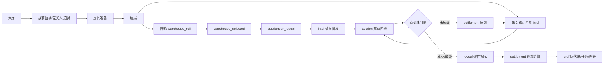

# 20260526 BidKingdom 策划归档 01 核心玩法与局内流程

## 一局拍卖的运行骨架

| 阶段 | 当前源码行为 | 配置来源 |
| --- | --- | --- |
| 账号/档案 | 游客或账号登录，创建/恢复 `PlayerProfile`，发放初始头像、金币、试用角色/道具、票券 | `Constant.init_items`、`init_head`、`Ticket` |
| 大厅 | 展示主界面、玩家资源、局外窗口入口和拍场入口 | `UIWnd`、`windowRegistry`、前端面板 |
| 战前 | 选择 `BidMap`、竞买人、局内道具、Bot 数量、明/暗拍模式 | `Map`、`BidMap`、`Hero`、`BattleItem` |
| 房间 | 根据 `BidMap.bidder_number` 限制人数；Bot 由 `RankMap.role_spawn` 和 `RankAi` 辅助生成 | `BidMap`、`RankMap`、`RankAi` |
| 建局 | `createMatch` 强制核心模式；按 `BidMap` 选择同一隐藏仓库，按地图给开局现金 | `BidMap`、`Drop`、`Item`、`RankMap`、`Constant.initial_points_chooses` |
| 首轮过场 | 当前源码首轮会进入候选仓和唱牌官线索流程 | `match.ts` 内硬编码时长和 `buildCoreAuctioneerChoices` |
| 情报阶段 | 回合开始触发地图技能和竞买人技能；玩家/Bot 可用试宝令 | `BidMap.map_random_skill`、`Hero.cast_type`、`Skill`、`SkillEffect`、`BattleItem` |
| 竞价阶段 | 玩家提交一次出价，`0` 为停手；可明拍或暗拍；竞价前仍可用试宝令 | `CoreAuctionMode`、`BidMap.map_time`、`RankMap.min_bid_range` |
| 回合反馈 | 计算最高价、第二价、领先差距和是否成交；未成交进入下一轮 | `BidMap.auction_rounds_rate` |
| 最终揭示 | 逐件揭示仓库藏品，结算支付、真实价值、套装加成、利润 | `Item`、`scoring` |
| 局外落账 | 发奖、入仓库、点亮图鉴、刷新任务成就、低资产返利、协会积分 | `Mission`、`Condition`、`LevelUp`、`Item.collection_coin`、`GuildPoints`、`Constant.bid_fanli` |

## 阶段机

## 当前阶段时长

| 阶段 | 时长 |
| --- | ---: |
| `warehouse_roll` | 4400 ms |
| `warehouse_selected` | 1500 ms |
| `auctioneer_reveal` | 5000 ms |
| `intel` | 3200 ms |
| `auction` | 取 `BidMap.map_time`，当前可玩局多为 40/50/60 秒 |
| 中间反馈 | 6000 ms |
| 最终 reveal | 按藏品品质 520 到 2200 ms 逐件播放 |

