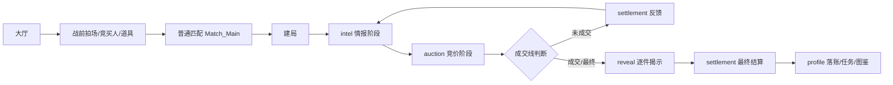

# 20260526 BidKingdom 策划归档 01 核心玩法与局内流程

## 一局拍卖的运行骨架

| 阶段 | 规则行为 | 配置来源 |
| --- | --- | --- |
| 账号/档案 | 游客或账号登录，创建/恢复 `PlayerProfile`，发放初始头像、金币、试用角色/道具、票券 | `Constant.init_items`、`init_head`、`Ticket` |
| 大厅 | 展示主界面、玩家资源、局外窗口入口和拍场入口 | `UIWnd`、`windowRegistry`、前端面板 |
| 战前 | 选择 `BidMap`、竞买人、局内道具、Bot 数量、明/暗拍模式 | `Map`、`BidMap`、`Hero`、`BattleItem` |
| 普通匹配 | 点击开始行动后回到大场景地图并显示原版 `Match_Main` 式匹配悬浮窗；内部按 `BidMap.bidder_number` 补 Bot，不显示房间等待开拍页 | `C2S_28_match_game`、`S2C_29_match_game`、`Match_Main`、`BidMap`、`RankMap`、`RankAi` |
| 建局 | `createMatch` 强制核心模式；按 `BidMap.map_group` 解析实际拍场，选择同一隐藏仓库，按地图给开局现金 | `BidMap`、`Drop`、`Item`、`RankMap`、`Constant.initial_points_chooses` |
| 拍场揭示表现 | 匹配入口 `BidMap.map_group` 非空时播放原版 `BattleRandom_Main` 式场景随机动画；普通局首轮存在地图公共情报时播放原版 `IntelligencePanel` 式公开情报暗牌动画，明牌后保留阅读停顿；二者只属于表现层，不进入独立玩法状态 | `BidMap.map_group`、`map_random_skill`、`openingCandidates`、`intelligenceChoices`、前端表现 |
| 情报阶段 | 首轮开局触发一次地图/场地情报；后续回合只按竞买人技能、试宝令等实际触发项新增信息 | `BidMap.map_random_skill[0]`、`Hero.cast_type`、`Skill`、`SkillEffect`、`BattleItem` |
| 竞价阶段 | 玩家提交一次出价，`0` 为停手；可明拍或暗拍；竞价前仍可用试宝令 | `CoreAuctionMode`、`BidMap.map_time`、`RankMap.min_bid_range` |
| 回合反馈 | 计算最高价、第二价、领先差距和是否成交；未成交进入下一轮 | `BidMap.auction_rounds_rate` |
| 最终揭示 | 逐件揭示仓库藏品，结算支付、真实价值、套装加成、利润 | `Item`、`scoring` |
| 局外落账 | 发奖、入仓库、点亮图鉴、刷新任务成就、低资产返利、协会积分 | `Mission`、`Condition`、`LevelUp`、`Item.collection_coin`、`GuildPoints`、`Constant.bid_fanli` |

## 阶段机

## 阶段时长

| 阶段 | 时长 |
| --- | ---: |
| `intel` | 3200 ms |
| `auction` | 取 `BidMap.map_time`，可玩局多为 40/50/60 秒 |
| 中间反馈 | 6000 ms |
| 最终 reveal | 全仓库先进入 loading 搜索态，再按仓库坐标逐件播放；品质 1/2/3 等待 1000 ms，品质 4/5 等待 2000 ms，品质 6 等待 3000 ms，品质 7 等待 4000 ms |

固定实现项：核心状态机、共享类型、房间调度和前端派生状态只保留原版复刻流程。场景随机动画和公开情报暗牌动画必须保留为原版客户端表现流程：`BattleRandom_Main` 只在匹配入口 `BidMap.map_group` 非空时由 `openingCandidates` 驱动，`IntelligencePanel` 由首轮 `intelligenceChoices` 和地图技能情报驱动；首轮 `intel` 表现窗口包含暗牌明牌后的阅读停顿，不新增第二套玩法状态，不改变出价规则。第二轮起不再新增地图/场地情报，中心列表只累计保留首轮场地情报并追加后续名士/道具技能信息。

## 普通匹配表现

BidKingdom 的普通“开始行动”按原版 `BattlePrevPanel.EnterBattle() -> Battle_Handler.C2S_MatchGame() -> PlayerManager.MatchGame() -> Match_Main` 流程表现：

1. 战前页确认后，不展示可见房间和“等待开拍”页。
2. 前端关闭场景详情，回到大场景地图，并在地图上显示匹配悬浮窗，悬浮窗从 00:00 起算并显示预计匹配时间。
3. 内部仍复用房间/Socket 作为服务端对局上下文，但该房间不作为普通匹配的玩家可见界面。
4. 匹配成功后直接进入随机拍场动画或战斗主界面。
5. 取消匹配返回主界面，并清掉内部房间会话。

私人房间/包厢流程才展示房间等待、准备、房主开始等界面。

视频核对基准为 `BidKing 2026-05-18 10-42-08` 的 30s-60s：点击开始行动后从场景详情退回大场景地图，左下匹配悬浮窗计时从 00:00 递增并显示预计匹配时间，随后匹配成功进入随机拍场 / 战斗；普通匹配路径不得展示 `RoomLobby`、准备按钮或房主开始按钮。

## 局内仓库面板

BidKingdom 局内右侧仓库按原版 `Battle_Main.Init()` 与 `WareHouse / Grid / GridItem` 实现：

1. 仓库面板只展示仓库格子和格内情报，不展示“最终竞拍价格 / 已开珍物估值 / 当前盈余”等结算摘要。
2. 右侧局内 HUD 保留原版 `yuguTxt` 等价文本“当前预估最低价格”。估价按 `BattleGridItemData.GetYujiPrice()` 口径累加：确定价优先，其次具体藏品价，否则只按轮廓尺寸、占格数和品质筛候选最低价；品类文本不参与最低价过滤。
3. 仓库背景格子使用原版 `Grid` 的 `itembox_pic_1` 格子素材，宽 10 列，按源码仓库 40 行滚动。
4. `intel` 阶段右侧仓库不一次性显示本轮全部技能结果；`match-core` 公共快照里的 `warehouseSlots` 只带历史已落知识，本轮技能结果仅保留在 `skillFeed.hitBoxList` 中；本轮每条技能先弹提示卡，提示卡隐藏并落到中间列表时，前端按该条 `hitBoxList` 同步揭示命中的仓库格信息，然后继续下一条。若服务端阶段已切到 `auction` 但本地当前轮提示序列尚未播放完，右仓仍继续使用隐藏格加历史日志重建基线，不得直接显示完整快照里的当前轮技能结果。
5. 每件格内藏品使用原版 `GridItem` 思路：正式品质框 `rank0-rank6` 承载未知、品质、轮廓、名称、价值或占格文本，不使用额外小底纹占位。

## 终局仓库揭露表现

BidKingdom 的终局揭露流程按原版 `Battle_Main.DoItemEffect()` 和 `GridItem` 行为实现：

1. 最终结算进入 reveal 后，仓库所有格子先以轮廓/占位状态铺满。
2. 每个已进入揭露队列的格子先显示 `img_loading_1` loading 搜索态，不显示品质边框、本体图标、名称和价值。
3. loading 等待结束后，同一帧呈现品质边框、本体图标、名称和价值。
4. 揭露顺序按仓库坐标从左到右、从上到下，对应原版 `GridItemData.pos` 从小到大。
5. 单件等待时长按原版 `GridItem.DoEffect()` 公式承接：`floor(clip.length + 0.5) * 1000 / speed`。当前网页对局使用默认速度 `speed=1`，房间揭露调度与前端 loading 展示使用同一品质等待表。

| BidKingdom rarity | 原版品质 | 原版动画 | 等待 |
| --- | ---: | --- | ---: |
| `junk` | 1 | `ani_bai` | 1000 ms |
| `common` | 2 | `ani_lv` | 1000 ms |
| `fine` | 3 | `ani_lan` | 1000 ms |
| `rare` | 4 | `ani_zi` | 2000 ms |
| `legendary` | 5 | `ani_jin` | 2000 ms |
| `mythic` | 6 | `ani_hong` | 3000 ms |

原版品质 7 使用 `ani_caise`，默认等待 4000 ms；当前 `Rarity` 枚举没有独立品质 7 档位，遇到源表品质 7 的局外流转仍按源品质字段记录。

## 协议与实现流

| 原版协议/数据 | 触发点 | 实现落点 | 固定字段 |
| --- | --- | --- | --- |
| `S2C_33_game_start_notify` | 首轮开始 | `match.ts` 的 `round_started` 协议引用 | `GameData` |
| `S2C_37_game_next_round_notify` | 后续回合开始 | `match.ts` 的 `round_started` 协议引用 | `GameData` |
| `C2S_34_game_bid / S2C_35_game_bid` | 玩家出价 | `submitBid()`、`roomActionRuntime.ts` | `Token`、`GameUid`、`BidPrice`、`ErrorCode` |
| `S2C_119_game_user_bid_price_notify` | 出价广播 | `bid_submitted` 事件 | `UserUid`、`GameUid` |
| `C2S_42_game_stand_down / S2C_43_game_stand_down` | 停手 | `passAuction()`、`roomActionRuntime.ts` | `Token`、`GameUid`、`ErrorCode` |
| `C2S_38_game_use_item / S2C_39_game_use_item` | 使用试宝令 | `useBattleItem()`、`roomActionRuntime.ts` | `Token`、`GameUid`、`ItemCid`、`ItemSkillLog` |
| `S2C_45_game_over_notify` | 终局 | `buildFinalSummary()`、`buildLossRecoveryByPlayerId()` | `WinUserUid`、`GameData`、`OldCollectionExp`、`NewCollectionExp`、`LossRecovery`、`UserSkillList` |

## GameData 快照

| 字段组 | 来源 | 实现 |
| --- | --- | --- |
| 拍场/轮次 | 实际 `BidMap`、`round.index` | `mapId`、`round` |
| 仓库 | `BidMap.drop_group_id -> Drop -> Item` 后的格子 | `stockContainer.stockBoxes[].item` |
| 玩家日志 | 每名玩家的 Hero、出价、停手、退出、道具携带和使用状态 | `userLog` |
| 技能日志 | 地图技能、竞买人技能、试宝令技能 | `heroSkillLog`、`mapSkillLog`、`itemSkillLog` |
| 计时 | `BidMap.map_time` 和阶段截止时间 | `nextRoundTime`、`serverTime`，协议单位为 Unix 秒 |
| 系统上限 | 系统类技能效果 | `roundCanUseItemCount`、`gameCarryItemMax`、`gameGoldRateMax` |
| 送拍字段 | 当前领先玩家或送拍所属玩家 | `sendAuctionUserUid`、`sendAuctionUserName`、头像框、称号字段 |

`buildBidKingGameDataSnapshot()` 是局内协议快照唯一入口。回合历史中的 `bidKingGameData`、终局 `bidKingReplay` 和送拍结果的 `gameData` 都按同一字段语义验收。

## 房间数据映射

| 原版 `RoomData` 语义 | BidKingdom 承接字段 |
| --- | --- |
| `MapCid` | `RoomSnapshot.selectedBidMapId`、`MatchRuntimeState.coreBidMapId` |
| `RoomPlayernum` | `RoomSnapshot.maxPlayers`，来自 `bidKingBidMapPlayerCount()` |
| `InitialBudget` | `RoomSnapshot.initialCash`，来自 `bidKingInitialCashForBidMap()` |
| `RoundTime` | `RuntimeRound.phaseEndsAt/auctionEndsAt`，拍卖段来自 `BidMap.map_time` |
| `BidRate` | `BidMap.auction_rounds_rate`，结算时生成 `RoundBidDecision` |
| `CanSelectHeros` | `validRole()` 和源 Hero 映射校验 |
| `CanSelectItems` | 战前/档案里的 `selectedItemList` 与 `BattleItem` 源链 |
| `GameData` | `PlayerSnapshot.public.currentRound` 和 `BidKingGameDataSnapshot` |
