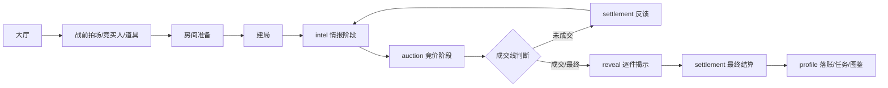

# 20260526 BidKingdom 策划归档 01 核心玩法与局内流程

## 一局拍卖的运行骨架

| 阶段 | 规则行为 | 配置来源 |
| --- | --- | --- |
| 账号/档案 | 游客或账号登录，创建/恢复 `PlayerProfile`，发放初始头像、金币、试用角色/道具、票券 | `Constant.init_items`、`init_head`、`Ticket` |
| 大厅 | 展示主界面、玩家资源、局外窗口入口和拍场入口 | `UIWnd`、`windowRegistry`、前端面板 |
| 战前 | 选择 `BidMap`、竞买人、局内道具、Bot 数量、明/暗拍模式 | `Map`、`BidMap`、`Hero`、`BattleItem` |
| 房间 | 根据 `BidMap.bidder_number` 限制人数；Bot 由 `RankMap.role_spawn` 和 `RankAi` 辅助生成 | `BidMap`、`RankMap`、`RankAi` |
| 建局 | `createMatch` 强制核心模式；按 `BidMap.map_group` 解析实际拍场，选择同一隐藏仓库，按地图给开局现金 | `BidMap`、`Drop`、`Item`、`RankMap`、`Constant.initial_points_chooses` |
| 拍场揭示表现 | 匹配入口 `BidMap.map_group` 非空时播放原版 `BattleRandom_Main` 式场景随机动画；存在地图公共情报时播放原版 `IntelligencePanel` 式公开情报暗牌动画；二者只属于表现层，不进入独立玩法状态 | `BidMap.map_group`、`map_random_skill`、`openingCandidates`、`intelligenceChoices`、前端表现 |
| 情报阶段 | 回合开始触发地图技能和竞买人技能；玩家/Bot 可用试宝令 | `BidMap.map_random_skill`、`Hero.cast_type`、`Skill`、`SkillEffect`、`BattleItem` |
| 竞价阶段 | 玩家提交一次出价，`0` 为停手；可明拍或暗拍；竞价前仍可用试宝令 | `CoreAuctionMode`、`BidMap.map_time`、`RankMap.min_bid_range` |
| 回合反馈 | 计算最高价、第二价、领先差距和是否成交；未成交进入下一轮 | `BidMap.auction_rounds_rate` |
| 最终揭示 | 逐件揭示仓库藏品，结算支付、真实价值、套装加成、利润 | `Item`、`scoring` |
| 局外落账 | 发奖、入仓库、点亮图鉴、刷新任务成就、低资产返利、协会积分 | `Mission`、`Condition`、`LevelUp`、`Item.collection_coin`、`GuildPoints`、`Constant.bid_fanli` |

## 阶段机

## 阶段时长

| 阶段 | 时长 |
| --- | ---: |
| `intel` | 3200 ms |
| `auction` | 取 `BidMap.map_time`，可玩局多为 40/50/60 秒 |
| 中间反馈 | 6000 ms |
| 最终 reveal | 按藏品品质 520 到 2200 ms 逐件播放 |

固定实现项：核心状态机、共享类型、房间调度和前端派生状态只保留原版复刻流程。场景随机动画和公开情报暗牌动画必须保留为原版客户端表现流程：`BattleRandom_Main` 只在匹配入口 `BidMap.map_group` 非空时由 `openingCandidates` 驱动，`IntelligencePanel` 由 `intelligenceChoices` 和地图技能情报驱动；二者不得反向延长服务器阶段、改变技能/道具窗口或改变出价计时。

## 协议与实现流

| 原版协议/数据 | 触发点 | 实现落点 | 固定字段 |
| --- | --- | --- | --- |
| `S2C_33_game_start_notify` | 首轮开始 | `match.ts` 的 `round_started` 协议引用 | `GameData` |
| `S2C_37_game_next_round_notify` | 后续回合开始 | `match.ts` 的 `round_started` 协议引用 | `GameData` |
| `C2S_34_game_bid / S2C_35_game_bid` | 玩家出价 | `submitBid()`、`roomActionRuntime.ts` | `Token`、`GameUid`、`BidPrice`、`ErrorCode` |
| `S2C_119_game_user_bid_price_notify` | 出价广播 | `bid_submitted` 事件 | `UserUid`、`GameUid` |
| `C2S_42_game_stand_down / S2C_43_game_stand_down` | 停手 | `passAuction()`、`roomActionRuntime.ts` | `Token`、`GameUid`、`ErrorCode` |
| `C2S_38_game_use_item / S2C_39_game_use_item` | 使用试宝令 | `useBattleItem()`、`roomActionRuntime.ts` | `Token`、`GameUid`、`ItemCid`、`ItemSkillLog` |
| `S2C_45_game_over_notify` | 终局 | `buildFinalSummary()`、`buildLossRecoveryByPlayerId()` | `WinUserUid`、`GameData`、`OldCollectionExp`、`NewCollectionExp`、`LossRecovery`、`UserSkillList` |

## GameData 快照

| 字段组 | 来源 | 实现 |
| --- | --- | --- |
| 拍场/轮次 | 实际 `BidMap`、`round.index` | `mapId`、`round` |
| 仓库 | `BidMap.drop_group_id -> Drop -> Item` 后的格子 | `stockContainer.stockBoxes[].item` |
| 玩家日志 | 每名玩家的 Hero、出价、停手、退出、道具携带和使用状态 | `userLog` |
| 技能日志 | 地图技能、竞买人技能、试宝令技能 | `heroSkillLog`、`mapSkillLog`、`itemSkillLog` |
| 计时 | `BidMap.map_time` 和阶段截止时间 | `nextRoundTime`、`serverTime`，协议单位为 Unix 秒 |
| 系统上限 | 系统类技能效果 | `roundCanUseItemCount`、`gameCarryItemMax`、`gameGoldRateMax` |
| 送拍字段 | 当前领先玩家或送拍所属玩家 | `sendAuctionUserUid`、`sendAuctionUserName`、头像框、称号字段 |

`buildBidKingGameDataSnapshot()` 是局内协议快照唯一入口。回合历史中的 `bidKingGameData`、终局 `bidKingReplay` 和送拍结果的 `gameData` 都按同一字段语义验收。

## 房间数据映射

| 原版 `RoomData` 语义 | BidKingdom 承接字段 |
| --- | --- |
| `MapCid` | `RoomSnapshot.selectedBidMapId`、`MatchRuntimeState.coreBidMapId` |
| `RoomPlayernum` | `RoomSnapshot.maxPlayers`，来自 `bidKingBidMapPlayerCount()` |
| `InitialBudget` | `RoomSnapshot.initialCash`，来自 `bidKingInitialCashForBidMap()` |
| `RoundTime` | `RuntimeRound.phaseEndsAt/auctionEndsAt`，拍卖段来自 `BidMap.map_time` |
| `BidRate` | `BidMap.auction_rounds_rate`，结算时生成 `RoundBidDecision` |
| `CanSelectHeros` | `validRole()` 和源 Hero 映射校验 |
| `CanSelectItems` | 战前/档案里的 `selectedItemList` 与 `BattleItem` 源链 |
| `GameData` | `PlayerSnapshot.public.currentRound` 和 `BidKingGameDataSnapshot` |
