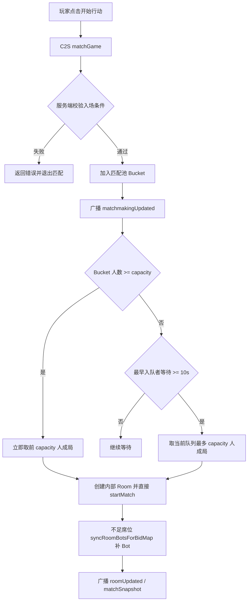

# 20260528 BidKingdom 普通匹配池设计文档

## 定位

本文档描述 BidKingdom 普通“开始行动”的目标匹配方案。原版源码可确认普通匹配入口为 `C2S_28_match_game / S2C_29_match_game`、客户端显示 `Match_Main` 计时悬浮窗、匹配成功后进入 `GameData` 对局；服务端匹配池内部实现没有完整源码可参考。因此本文属于按原版协议外观、现有房间/对局结构和商业游戏常规做法推断的 BidKingdom 后端设计，不写入原版源码事实归档。

目标不是私人房间。普通匹配不展示房间码、准备、房主开始等界面；房间对象只作为服务端内部承载 `RoomData/GameData`、Socket 广播和重连的上下文。

## 设计目标

1. 多个玩家连接同一服务并在匹配窗口内点击开始行动，应进入同一个匹配池。
2. 人数达到 `BidMap.bidder_number` / `bidKingBidMapPlayerCount()` 后立即成局。
3. 最早进入队列的玩家等待达到超时阈值后，用当前队列中的玩家成局，缺席位用 Bot 补齐。
4. 玩家取消、断线、重复点击和资源不足都必须由服务端权威处理，不能依赖前端本地 5 秒定时器。
5. 普通匹配成功后仍保持原版表现：战前详情关闭，回到大场景地图显示匹配悬浮窗；成功后进入场景随机动画或战斗主界面。

## 匹配池分桶

匹配池按 `MatchmakingBucketKey` 分桶，避免规则不同的玩家被拉到同一局：

| 维度 | 说明 |
| --- | --- |
| `mode` | 固定为 `normal`，与私人房间分离 |
| `selectedBidMapId` | 玩家选择的匹配入口拍场；随机拍场入口也按入口 `BidMap.id` 分桶，实际拍场仍由后续 `GameData.MapId` 决定 |
| `coreAuctionMode` | 明拍/暗拍等规则必须一致 |
| `capacity` | 来自 `bidKingBidMapPlayerCount(selectedBidMapId)` |
| `rulesVersion` | 可选，后续用于灰度和版本隔离 |

首版不按段位、地区和延迟拆分，避免低并发下匹配过慢。后续可在 `MatchmakingBucketKey` 中加入 `rankBand`、`region`、`partySize` 等维度。

## 核心流程



## 时间策略

| 参数 | 建议值 | 说明 |
| --- | ---: | --- |
| `MATCHMAKING_MAX_WAIT_MS` | 10000 | 最早入队玩家等待上限；到点即成局 |
| `MATCHMAKING_TICK_MS` | 250 | 服务端检查队列的节拍，也可用每个 Bucket 的单独 timer |
| `MATCHMAKING_CANCEL_GRACE_MS` | 0 | 主动取消立即移出队列 |
| `MATCHMAKING_DISCONNECT_GRACE_MS` | 3000 | 排队期间断线可短暂保留，超时移除；已成局后走对局重连 |

预计匹配时间 `estimatedSeconds` 由服务端返回。首版可返回 `ceil(MATCHMAKING_MAX_WAIT_MS / 1000)` 或结合 `RankMap.match_time`、近期同 Bucket 平均等待做展示；该值只用于 UI，不决定真实开局时机。

## 队列规则

1. 同一 `profileId/playerId` 同时只能存在一个普通匹配队列项。
2. 重复点击开始行动时，服务端返回当前队列状态，不创建第二个队列项。
3. 玩家切换拍场、竞买人、道具后再次开始匹配，需要先取消旧队列再以新参数入队。
4. 成局时按入队顺序取人，保证先来先服务。
5. 如果队列人数超过容量，例如 6 人进入 4 人拍场，则前 4 人立即成局，剩余 2 人留在队列，并以剩余队列最早入队时间重新计算超时。
6. 成局前再次校验每个真人的入场条件、门票/金币和所选竞买人/道具；失败玩家从队列移除并收到错误，剩余玩家继续按规则尝试成局。
7. 资源消耗在成局瞬间执行，不在入队时扣除；玩家主动取消或排队失败不扣资源。

## 服务端数据结构

```ts
interface MatchmakingEntry {
  ticketId: string;
  socketId: string;
  playerId: string;
  playerName: string;
  profileId: string;
  selectedBidMapId: number;
  coreAuctionMode: CoreAuctionMode;
  roleId?: string;
  sourceHeroId?: number;
  selectedItemList?: number[];
  enqueuedAt: number;
  lastSeenAt: number;
  status: 'queued' | 'matched' | 'cancelled';
}

interface MatchmakingBucket {
  key: string;
  capacity: number;
  entries: MatchmakingEntry[];
  timer?: NodeJS.Timeout;
}
```

服务端维护：

| 结构 | 用途 |
| --- | --- |
| `buckets: Map<string, MatchmakingBucket>` | 按规则分桶的匹配池 |
| `playerToTicket: Map<string, string>` | 防止同一玩家重复入队 |
| `socketToTicket: Map<string, string>` | 断线、取消时快速定位队列项 |

## Socket 协议

普通匹配应新增或改造为独立事件，不再复用 `createRoom + 前端 setTimeout(startMatch)`。

| 方向 | 事件 | 载荷 |
| --- | --- | --- |
| C2S | `matchGame` | `playerName/profileId/selectedBidMapId/coreAuctionMode/roleId/sourceHeroId/selectedItemList` |
| S2C ack | `matchGame` | `{ ok, ticketId, estimatedSeconds, queuedCount, capacity }` 或 `{ ok:false, error }` |
| S2C | `matchmakingUpdated` | `{ ticketId, elapsedMs, estimatedSeconds, queuedCount, capacity }` |
| C2S | `cancelMatchmaking` | `{ ticketId }` |
| S2C | `matchmakingCancelled` | `{ ticketId }` |
| S2C | `matchFound` | `{ roomCode, matchId }`，随后继续发 `roomUpdated`、个人 `matchSnapshot` |

私人房间保留 `createRoom / joinRoom / startMatch`。普通匹配不暴露房间码，不允许其他玩家通过 `joinRoom` 加入该内部房间。

## 成局与房间承接

匹配成功后服务端创建内部 `Room`：

1. `hostId` 可使用本批第一个真人，仅作为内部字段和重连归属，不显示房主 UI。
2. `selectedBidMapId/coreAuctionMode/initialCash/totalRounds` 来自 Bucket 和配置。
3. 先加入本批真人，再调用 `syncRoomBotsForBidMap()` 补足 `capacity`。
4. 调用现有 `startMatch(room)` 生成 `MatchRuntimeState`，复用 `createMatch()`、`startNextRound()`、`roomRoundRuntime.runCoreRound()`。
5. 对所有真人广播 `roomUpdated` 和个人 `matchSnapshot`。
6. 前端收到 `matchSnapshot` 后清除匹配悬浮窗，进入随机拍场动画或战斗。

## 取消与断线

| 场景 | 行为 |
| --- | --- |
| 主动取消 | 从队列移除；清理 `playerToTicket/socketToTicket`；广播取消成功；不扣资源 |
| 排队期间断线 | 标记 `lastSeenAt`；超过 `MATCHMAKING_DISCONNECT_GRACE_MS` 仍未重连则移出队列 |
| 成局后断线 | 不取消对局，保留玩家席位，走现有 `rejoinRoom` / `player_rejoined` |
| 队列中资源失效 | 成局前校验失败，移除该玩家并返回错误 |
| 服务端重启 | 首版内存队列丢失，客户端重连后回到未匹配状态；生产环境可用 Redis 持久化队列 |

## 扩展到多进程

当前单 Node 服务可用内存 `Map` 实现。若部署多实例，需要把匹配池迁到 Redis：

1. 每个 Bucket 用 Redis sorted set 按 `enqueuedAt` 排序。
2. 成局时对 Bucket key 加分布式锁，原子取前 `capacity` 人。
3. 队列项用 hash 存玩家参数，断线和取消用 ticketId 删除。
4. 成局后通过 socket adapter 找到玩家所在实例并投递 `matchFound/matchSnapshot`。

## 前端表现

前端继续保留原版表现：

1. 点击开始行动后关闭场景详情，回到大场景地图。
2. 前端完成本地入场校验后立即进入匹配态，显示 `Match_Main` 式小悬浮窗，计时从 00:00 递增。
3. 服务端 `matchGame` ack 成功后写入 `ticketId` 并用服务端 `estimatedSeconds` 修正悬浮窗预计时间；ack 失败则退出匹配态并显示错误。
4. 后续 `matchmakingUpdated` 只修正排队状态，不负责首次打开悬浮窗。
5. 取消按钮发送 `cancelMatchmaking`，不能只清本地 timer。
6. 不显示 `RoomLobby`、准备按钮、房主开始按钮。

## 实现落点

| 模块 | 改动 |
| --- | --- |
| `packages/shared/src/index.ts` | 补 `matchGame/cancelMatchmaking/matchmakingUpdated/matchFound` socket 类型 |
| `apps/server/src/domain/battle/matchmakingRuntime.ts` | 新增匹配池、分桶、超时、成局逻辑 |
| `apps/server/src/roomManager.ts` | 绑定 `matchGame/cancelMatchmaking`；普通匹配创建内部房间并直接开局 |
| `apps/web/src/bidking/room/useRoomActions.ts` | `matchGame()` 改为发服务端匹配请求，删除本地 5 秒 `startMatch` timer |
| `apps/web/src/bidking/app/BidKingApp.tsx` | 根据服务端 `matchmakingUpdated/matchFound/cancelled` 管理匹配悬浮窗 |
| `apps/web/src/bidking/battlePrev/BattlePrevPanelView.tsx` | 保持当前匹配悬浮窗视觉，只改数据来源 |
| `apps/server/tests/roomManager.test.ts` | 增加多人同池、人数满立即开局、超时补 Bot 测试 |

## 验收场景

| 场景 | 期望 |
| --- | --- |
| 1 名玩家开始匹配，10 秒内无人加入 | 10 秒到点开局，真人 1 人，其余席位 Bot |
| 4 人拍场中 4 名玩家 5 秒内开始匹配 | 不等 10 秒，4 人立即进入同一局 |
| 4 人拍场中 2 名玩家 10 秒内开始匹配 | 第一个玩家超时后，两名真人同局，其余席位 Bot |
| 6 名玩家进入同一个 4 人 Bucket | 前 4 人一局，后 2 人留队等待下一局 |
| 玩家选择不同 `selectedBidMapId` | 分属不同 Bucket，不会同局 |
| 玩家选择不同 `coreAuctionMode` | 分属不同 Bucket，不会同局 |
| 玩家取消匹配 | 服务端移除队列项，不扣门票/金币，不进入房间 |
| 玩家重复点击开始匹配 | 仍只有一个队列项，返回当前 ticket 状态 |
| 成局时某玩家资源不足 | 该玩家失败退出队列，其余玩家继续按规则匹配 |

## 已实现口径

当前实现已改为服务端权威匹配池：玩家先进入 Bucket，人数够则立即成局，最早玩家等待 10 秒仍不足则当前队列成局并补 Bot。前端只负责显示匹配状态和取消请求，不决定开局时间。

私人房间仍保留 `createRoom / joinRoom / startMatch`。普通匹配使用 `matchGame / cancelMatchmaking`，匹配成功后服务端创建内部 Room 并直接生成 `MatchRuntimeState`，该 Room 不进入可见房间等待页。

点击开始行动后，前端在本地校验通过时立即切到匹配悬浮窗，避免等待服务端 ack 期间没有反馈。服务端 ack 成功后补齐 `ticketId` 和预计时间；服务端拒绝时清除本地匹配态并显示拒绝原因。
