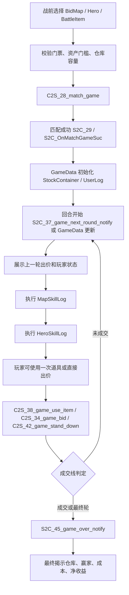

# 20260526 竞拍之王源码策划归档 01 - 局内核心流程与协议

## 局内主循环

原版源码的局内流程可以归纳为：

## 战前入口

战前 UI 在 `BattlePrevPanel_Main / BattlePrevPanel / BattlePrev_BattleSet / BattlePrev_MapItemPanel` 一组类中完成：

- `BattlePrev_MapItemPanel` 展示 `BidMap` 名称、描述、资源图、费用、资产要求、回合数量和人数。
- `BattlePrevPanel.EnterBattle()` 先校验 `curBidMap.Costs.CheckItemEnough()` 和 `curBidMap.Requires.CheckItemEnough()`。
- 如果金币不足，会进入低保检查：当前资产低于 `relief_fund_limit` 且今日次数未满时，引导领取低保。
- 如果仓库格满，提示 `ui_gridsfull_notify`。
- 通过校验后保存角色、皮肤、带入道具预设，并调用 `Battle_Handler.C2S_MatchGame(curBidMap.id, heroId, useItems, callback)`。

## 匹配和开局协议

`PlayerManager.MatchGame()` 发送：

| 协议 | 字段 | 含义 |
| --- | --- | --- |
| `C2S_28_match_game` | `Token` | 玩家登录令牌 |
|  | `MapCid` | 选择的 `BidMap.id` |
|  | `HeroCid` | 选择的 `Hero.id` |
|  | `MatchType` | 匹配类型 |
|  | `SelectItemList` | 带入局内道具 |

匹配成功后，客户端进入 `Match_Main`，再由服务器推送真实 `GameData`。原版客户端还保留 `GameServerDemo.ServerHandler`，它会在本地按 `bidder_number` 组房间，但这只是 Demo 逻辑。

## GameData 数据骨架

`Protodata/GameData.cs` 是局内权威快照。关键字段：

| 字段 | 含义 |
| --- | --- |
| `Uid` | 对局唯一 id |
| `MapId` | 本局实际 `BidMap.id` |
| `Round` | 当前轮，客户端展示时加 1 |
| `StockContainer` | 本局仓库与藏品格数据 |
| `UserLog` | 玩家、角色、皮肤、出价、弃权、用道具记录 |
| `HeroSkillLog` | 角色技能触发日志 |
| `MapSkillLog` | 场景技能触发日志 |
| `ItemSkillLog` | 局内道具触发日志 |
| `NextRoundTime` | 下一轮截止时间 |
| `SelectItemCount` | 可选道具数量 |
| `RoundCanUseItemCount` | 每轮可用道具次数 |
| `GameCarryItemMax` | 带入上限 |
| `GameGoldRateMax` | 金币倍率/限制上限 |
| `GameType` | 普通、暗拍、房间等类型 |
| `ServerTime` | 服务端时间同步 |

## 回合开始处理

`Battle_Handler.S2C_OnRoundStart(GameData)` 做以下事：

1. 缓存 `gameData`，读取 `MapId`、`Round`、`MapSkillLog`。
2. 从 `MapSkillLog` 中筛出 `CastRound == roundNum` 的场景技能。
3. 从 `HeroSkillLog` 中筛出当前回合角色技能。
4. 用 `UserLog` 构建 `PlayerInBattleData`，并同步自己是否已弃权。
5. 如果不是第 1 个回合，展示上一轮所有玩家的出价。
6. 触发 `E_OnRoundStart`，由 `Battle_Main` 刷新玩家栏、回合、倒计时、局内 UI。
7. 依次处理场景技能和角色技能，展示技能描述和同步已披露的格子。
8. 派发 `E_OnRoundStartBid`，玩家可以开始操作。

普通对局在第 0 轮如存在场景情报，会自动打开 `BattleIntelligence` 面板；训练、回放、重连会走各自的缓存和补放逻辑。

## 玩家回合操作

玩家每轮核心操作有三类：

| 操作 | 客户端方法 | 协议 | 限制 |
| --- | --- | --- | --- |
| 出价 | `Battle_Handler.C2S_Auction(price)` | `C2S_34_game_bid` | 已弃权、已出价、回放状态不可出价 |
| 使用道具 | `Battle_Handler.C2S_UseItem(data)` | `C2S_38_game_use_item` | `UseItemLog` 当前轮没有记录时才可用 |
| 弃权 | `Battle_Handler.C2S_Qiquan()` | `C2S_42_game_stand_down` | 弃权后不可再出价/用道具 |

`Battle_InputDevice` 提供出价输入、隐藏金额、金额颜色、保底上限和快捷位输入。金额颜色阈值是 `<10000` 灰、`<100000` 绿、`<1000000` 蓝、`<10000000` 橙、以上红。

## 成交线

原版 `BidMap.auction_rounds_rate` 是每轮成交线。源码附带的 `GameServerDemo.CheckGameOver()` 逻辑是：

- 取本轮最高价 `maxPrice` 和第二高价 `secondMax`。
- 当前轮倍率 `rate = auction_rounds_rate[round - 1] * 0.001`。
- 若 `maxPrice > secondMax * rate`，本轮成交。
- 若没有达到成交线，进入下一轮。
- 常见倍率 `[2000,1600,1300,1100,0]` 对应前四轮逐渐降低门槛，第五轮兜底。

真实线上服务端不会由 Unity 客户端本地判定，它通过 `S2C_45_game_over_notify` 推送最终结果；但上述 Demo 逻辑清楚说明了表字段的设计意图。

## 局内模式

| 模式 | 源码入口 | 特点 |
| --- | --- | --- |
| 普通匹配 | `BattleType.Normal` | 通过 `C2S_28_match_game` 匹配，服务端推送 `GameData` |
| 模拟训练 | `BattleType.Training` | `CreateSimGame` 创建，使用 `SimSelectItemList / SimBuffItemList` |
| 私人房间 | `BattleType.PrivateRoom` | 使用 Room 系列协议，房主配置人数、时间、倍率、道具预算 |
| 回放 | `BattleType.Playback` | 从历史 `GamePlayBackData` 逐轮播放技能和出价 |
| 重连 | `S2C_OnBattleReconnect` | 按 `GameData` 中所有日志补放到当前轮 |

